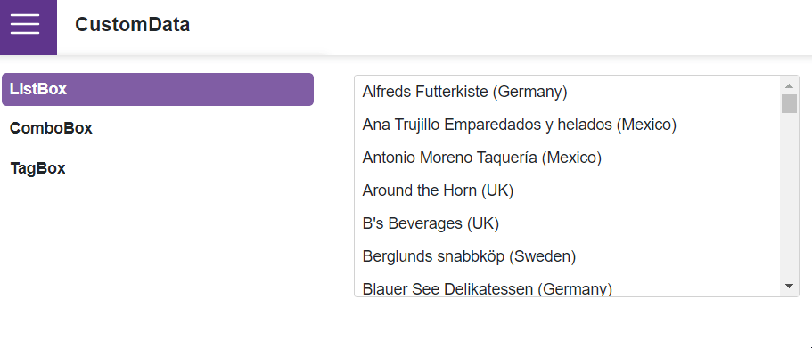

<!-- default badges list -->

<!-- default badges end -->
# Data Editors for Blazor - Custom data binding

This example binds DevExpress Blazor [ListBox](https://docs.devexpress.com/Blazor/DevExpress.Blazor.DxListBox-2), [ComboBox](https://docs.devexpress.com/Blazor/DevExpress.Blazor.DxComboBox-2), and [TagBox](https://docs.devexpress.com/Blazor/DevExpress.Blazor.DxTagBox-2) to a remote Web API service and uses the `CustomData` property to implement custom data load logic.

## Overview

To bind an editor to data from a Web API service, complete the following steps:

1. Reference the [DevExtreme.AspNet.Data](https://github.com/DevExpress/DevExtreme.AspNet.Data/blob/master/README.md) library in your project. Add the following directives to files where you will write data loading code:

    * @using DevExtreme.AspNet.Data
    * @using DevExtreme.AspNet.Data.ResponseModel

2. Use a component's `CustomData` property to implement an ansynchronous function. This function returns a [Task\<LoadResult>](https://devexpress.github.io/DevExtreme.AspNet.Data/net/api/DevExtreme.AspNet.Data.ResponseModel.LoadResult.html) object and accepts the following parameters:

    * A [DataSourceLoadOptionBase](https://devexpress.github.io/DevExtreme.AspNet.Data/net/api/DevExtreme.AspNet.Data.DataSourceLoadOptionsBase.html) object.
    * A [CancellationToken](https://learn.microsoft.com/en-us/dotnet/api/system.threading.cancellationtoken?view=net-7.0) object.

3. In the remote service, implement an [API controller](https://docs.devexpress.com/AspNetCore/401020/devextreme-based-controls/concepts/bind-controls-to-data/api-controllers) and create a `LoadResult` object based on load options.

## Files to Review

- [ListBox.razor](CS/CustomData/Shared/ListBox.razor)
- [ComboBox.razor](CS/CustomData/Shared/ComboBox.razor)
- [TagBox.razor](CS/CustomData/Shared/TagBox.razor)
- [WebApiLookup.cs](CS/CustomData/Data/WebApiLookup.cs)
- [Program.cs](CS/CustomData/Program.cs)

## Documentation

### ListBox

- [Bind to Data](https://docs.devexpress.com/Blazor/DevExpress.Blazor.DxListBox-2#bind-to-data)
- [CustomData](https://docs.devexpress.com/Blazor/DevExpress.Blazor.DxListBox-2.CustomData)

### ComboBox

- [Bind to Data](https://docs.devexpress.com/Blazor/DevExpress.Blazor.DxComboBox-2#bind-to-data)
- [CustomData](https://docs.devexpress.com/Blazor/DevExpress.Blazor.DxComboBox-2.CustomData)

### TagBox

- [Bind to Data](https://docs.devexpress.com/Blazor/DevExpress.Blazor.DxTagBox-2#bind-to-data)
- [CustomData](https://docs.devexpress.com/Blazor/DevExpress.Blazor.DxTagBox-2.CustomData)
<!-- feedback -->
## Does this example address your development requirements/objectives?

 

(you will be redirected to DevExpress.com to submit your response)
<!-- feedback end -->
